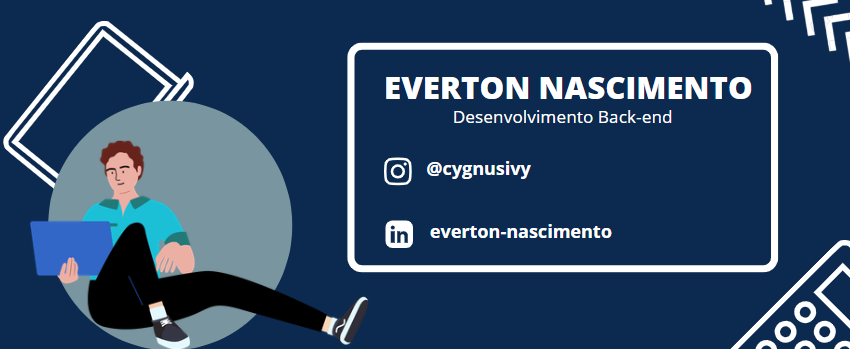

  

  <table>
    <tr>
        <td></td>
        <td></td>
    </tr>   
  </table>

<h1> Olá, sejam bem-vindos 👋</h1>
Esse é o perfil de Everton Nascimento, sou aluno do Curso de Análise e Desenvolvimento de Sistemas na Faculdade Senac - Pernambuco).
